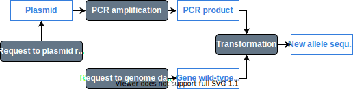

# Readme

## About

ShareYourCloning is a web application to generate molecular cloning strategies in json format, and share them with others. It is the first brick in the construction of [Genestorian](https://www.genestorian.org/), a web application for model organism collections.

### Biological background

Recombinant DNA technology is used in a variety of research and industry fields to generate new DNA molecules by combining fragments of existing ones. This means that every molecule in a laboratory collection was created by "cutting and pasting" the sequences of existing molecules.

The aim of this application is to provide a web interface to document the generation of new DNA molecules from existing ones. You can imagine it as a family tree builder, where there are two kinds of entities:

1. The DNA molecules
2. The "sources", which are experimental steps that take 0 or more DNA molecules as an input, and generate a single output. There can be two kinds of sources:
	1.	**Sources of sequences without a parent entity:** They represent either resources imported from a repository (e.g., a plasmid) or a naturally occurring sequence (e.g., the sequence of a gene in the reference strain). The information in the step may contain a reference to a file uploaded by the user, or an entry in a repository (identifier in Addgene or GenBank, request to a genome database, etc.). 
	2. **Sources of sequences representing cloning steps combining existing sequences to generate new ones:** They contain references to the input and output DNA sequences, the method name (digestion, ligation, etc.) and the minimal information to do the cloning step in silico.

See the figure below for an example of PCR-based gene targeting, in which a fragment of a plasmid is amplified by PCR with primers that contain 5' extensions homologous to target sequences in the genome. Cells are then transformed with the PCR fragment, which integrates into the genome through homologous recombination.



There is a mockup of an interface representing this cloning strategy [here](https://www.genestorian.org/html/web_interface/index.html)

### Encoding this information

The idea is to eventually use [SBOL](https://sbolstandard.org/) to encode all the information, but as a first approach, I will start with json. As of now, the data looks more or less like this.

Entities, which represent DNA molecules look like this:

```json
{
	"kind": "entity",
	"id": "some_unique_id",
	// There should be eventually more ways of 	specifying the sequence
	// for now just genbank support (a popular text-based file format
	// to store DNA sequence and its features)
	"sequence":
    {
        "type": "file",
        "file_extension": "gb",
        "file_content": "content_of_gb_file"
    }

}
```

Sources, as described [above](#biological-background) will look like this:

```javascript
// An example of a restriction
{
	kind: 'source',
	id: 'some_unique_id',
	// There can be multiple inputs for example for an assembly of multiple fragments
	input: ['id_of_input_sequence'],
	// There can only be one output selected
	output: 'id_of_output_sequence',
	// Some methods would return more than one possible output (e.g., cutting a linear fragment of DNA into two)
	// This specifies which of the fragments corresponds to the output
	output_index: some_integer
}

// An example of an import from a file
{
	kind: 'source',
	id: 'some_unique_id',
	// A file import has no parent sequence
	input: [],
	// There can only be one output selected
	output: 'id_of_output_sequence',
	// Some files, like fasta may contain multiple sequences
	// This specifies which of the sequences corresponds to the output
	output_index: some_integer
}

```

## Built with

ShareYourCloning has a frontend application and backend application.

### Backend

The backend is a web API built with python flask. For information on what it does, and how to install it and what it does see [this](./src/backend/readme.md).

### Frontend

The frontend application is built with react, and it is the "family tree builder" that you will see in your browser. For more info on what it does and how to install it see [this](./src/frontend/readme.md)

## Gettings started

You should install and start both the [backend](./src/backend/readme.md)

## Vscode Settings

If you want to have the same environment for development that I am using, you can create a folder in the main directory called `.vscode`, there you should create a file `settings.json` as below

You will have to change `path/to/python/environment/bin/` by the location of the bin folder of the virtual environment created by pipenv. For that, go to `src/backend/` and run `pipenv shell` to activate the virtual environment (after you have installed the dependencies), and then run `which python`.

```json
{
    "files.exclude": {
        "**/.git": true,
        "**/.svn": true,
        "**/.hg": true,
        "**/CVS": true,
        "**/.DS_Store": true,
        "**/*.pyc": true,
        "**/__pycache__": true
    },
    "python.linting.enabled": true,
    "python.linting.flake8Enabled": true,
    "python.linting.flake8Path": "path/to/python/environment/bin/flake8",
    "python.pythonPath": "path/to/python/environment/bin/python",
    "emmet.includeLanguages": {
        "javascript": "javascriptreact"
     },
     "eslint.nodePath": "./src/frontend/node_modules",
     "eslint.options": { "overrideConfigFile": "./src/frontend/.eslintrc.json"},
     "eslint.format.enable": true,
     "[javascript]": {
         "editor.defaultFormatter": "dbaeumer.vscode-eslint"
     },
     "[javascriptreact]": {
        "editor.defaultFormatter": "dbaeumer.vscode-eslint"
    }
}
```

## Docker container

This is in the making, just ignore it for now.

In the `Dockerfile` you might want to change your timezone (see comments)

You will have to give the container a name (I used elifesprint), and build it from the `Dockerfile`

```
# In the directory where Dockerfile is located we build the image
docker build -t elifesprint .

# To explore the file system (this leaves the container on)
docker run -dit --name elifesprint elifesprint
docker exec -it elifesprint bash
```
