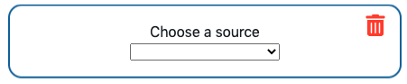
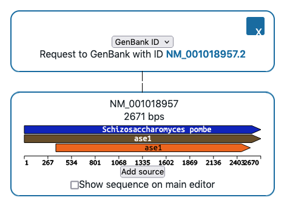

# Readme

## Intro

ShareYourCloning is a web application to generate molecular cloning strategies in json format, and share them with others. It is the first brick in the construction of [Genestorian](https://www.genestorian.org/), a web application for model organism collections.


## :timer_clock: Getting started in 5 minutes

If you just want to try the application, the easiest way is to go to the hosted version at: [https://shareyourcloning.netlify.app/](https://shareyourcloning.netlify.app/).

If you want to quickly set up a local instance of the application using docker, you can use the images of backend and frontend hosted in docker hub:

```bash
# see docker-compose.yml
docker-compose pull
docker-compose up
```

Then, the application should be running at [http://localhost:3000](http://localhost:3000).

## Contributing

If you are interested in contributing, check the [contribution guidelines](CONTRIBUTING.md).

## Built with 🔨

ShareYourCloning has a frontend application and backend application.

### Backend

The code of the backend is here: [https://github.com/manulera/ShareYourCloning_backend](https://github.com/manulera/ShareYourCloning_backend)

The backend is a web API built with FastAPI flask. For information on what it does, and how to install it and what it does see [this](https://github.com/manulera/ShareYourCloning_backend).

### Frontend

The code of the frontend is here: [https://github.com/manulera/ShareYourCloning_frontend](https://github.com/manulera/ShareYourCloning_frontend)

The frontend application is built with react, and it is the "family tree builder" that you will see in your browser. For more info on what it does and how to install it see [this](https://github.com/manulera/ShareYourCloning_frontend)

## About

### :dna: Biological background

Recombinant DNA technology is used in a variety of research and industry fields to generate new DNA molecules by combining fragments of existing ones. This means that every molecule in a laboratory collection was created by "cutting and pasting" the sequences of existing molecules.

The aim of this application is to provide a web interface to document the generation of new DNA molecules from existing ones, and to export this information to share it with others. You can imagine it as a family tree builder, where there are two kinds of entities:

1. The DNA molecules, or `entities`.
2. The `sources`, which are experimental steps that take 0 or more `entities` as an input, and generate a single output. There can be two kinds of `sources`:
	1.	**`Sources` without a parent `entity`:** They represent the source of a DNA molecule received externally (e.g., a plasmid received from a collaborator) or a naturally occurring sequence (e.g., the sequence of a gene in the reference strain). The information in the step may contain a reference to a file uploaded by the user, or an entry in a repository (identifier in Addgene or GenBank, request to a genome database, etc.).
	2. **`Sources` representing cloning steps combining existing `entities` to generate new `entities`:** They contain references to the input and output DNA sequences, the method name (digestion, ligation, etc.) and the minimal information to do the cloning step in silico.

See the figure below for an example of PCR-based gene targeting, in which a fragment of a plasmid is amplified by PCR with primers that contain 5' extensions homologous to target sequences in the genome. Cells are then transformed with the PCR fragment, which integrates into the genome through homologous recombination.


There is a mockup of an interface representing this cloning strategy [here](https://www.genestorian.org/html/web_interface/index.html)

### Encoding this information

The idea is to eventually use [SBOL](https://sbolstandard.org/) to encode all the information, but as a first approach, json is used. You can find the json schema use to describe the `sources` and `entities` in the Schema section of the [api documentation](https://shareyourcloning.api.genestorian.org/docs). These schema is generated by FastAPI from python classes defined using pydantic. You can find the model declarations [here](https://github.com/manulera/ShareYourCloning_backend/blob/master/pydantic_models.py).

In summary, `entities` representing DNA molecules look like this:

```javascript
{
	kind: 'entity',
	id: 'some_unique_id',
	// There should be eventually more ways of specifying the sequence
	// for now just genbank support (a popular text-based file format
	// to store DNA sequence and its features).
    // Note that Genbank files have no support for representing DNA
    // molecules with overhangs.
	sequence:
    {
        type: 'file',
        file_extension: 'gb',
        file_content: 'content_of_gb_file',
        // Taken from pydna's `dseq::ovhg`
        // An integer describing the length of the
        // crick strand overhang in the 5' of the molecule,
        // or 3' of the crick strand
        overhang_crick_3prime: int,
        // The equivalent of overhang_crick_3_prime, but for
        // the watson strand.
        overhang_watson_3prime: int
    }
}
```

Sources, as described [above](#biological-background) will look like this:

```javascript
// An example of a restriction
{
	kind: 'source',
	id: 'some_unique_id',
	type: 'restriction',
	// There can be multiple inputs for example for an assembly of multiple fragments
	input: ['id_of_input_sequence'],
	// We could specify multiple enzymes
	restriction_enzymes: ['EcoRI'],
	// There can only be one output selected
	output: 'id_of_output_sequence',
	// Some methods would return more than one possible output (e.g., cutting a linear fragment of DNA into two)
	// This specifies which of the fragments corresponds to the output
	output_index: some_integer
}

// An example of an import from GenBank
{
	kind: 'source',
	id: 'some_unique_id',
	type: "genbank_id",
 	kind: "source",
	genbank_id: "NM_001018957.2"
	// A GenBank import has no parent sequence
	input: [],
	// There can only be one output selected
	output: 'id_of_output_sequence',
	// Some files, like fasta may contain multiple sequences
	// This specifies which of the sequences corresponds to the output
	output_index: some_integer
}

```

## Workflow

From the json above, you can see the modular nature of the task. Every `entity` comes from a `source`, and every `entity` can be the input of another `source`.

The application frontend provides an interface where the user can specify a `source` (with or without inputs). This `source` is sent to the backend in a `POST` request, where the step encoded in the `source` is executed, and the output `entity` is returned and displayed in the frontend. When multiple outputs could come out of a `source` (for example, a restriction enzyme digestion), the user can select which one of them is the desired output. Then the user can use the output `entity` as an input for a new `source`, and so on.

In the browser, you should see something like this:



This is an interface element representing a `source`. You can start by selecting `GenBank ID`, and this will open an input text field where you can type the GenBank id of a gene, for example `NM_001018957.2` for _S. pombe_ ase1 gene. When you click submit, a child element will appear, representing the sequence corresponding to the GenBank id you just typed.




If you click on the eye icon on the top right corner, the sequence will be displayed in the editor at the bottom of the page, and you can see more details.


Now we can perform molecular cloning steps on this sequence. Below, there is a button that says `Add source`. If you click it, you can now use this sequence as the input for another source. Choose `Restriction`. This will allow you to type in the name of a restriction enzyme, and will return the resulting fragments by calling the backend API endpoint `/restriction`. You can type `EcoRI` as an example. This will expand the current node of the tree, and will show the resulting fragments. You can move between them by using the arrows. When you see the fragment you want click choose fragment, and this will pop the resulting sequence.

> **_NOTE:_**
In essence, restriction enzymes are molecular machines that recognise a palindromic sequence in the DNA (sequence that reads the same backward and forward), and cut the DNA there.
This should give you a basic understanding, but there are more nuances. Check [this section](#restriction-enzymes) for more.

## Molecular Biology Methods

A series of molecular biology methods explained for the non-biologist.

### Restriction enzymes
For more detail go to [wikipedia page](https://en.wikipedia.org/wiki/Restriction_enzyme).

## Acknowledgements :pray:

Thanks to [@ikayz](https://github.com/ikayz) for initial improvements to the frontend.

Thanks to [@joyceykao](https://github.com/joyceykao) for discussions on how to approach UI/UX and users interview.

Thanks to [@maratumba](https://github.com/maratumba) for recommending the usage of FastAPI and for giving some general guidelines for the development of the backend and hosting.

Thanks to the whole [Open Life Science](https://openlifesci.org/) organising team and community, which were incredibly helpful in setting the foundations of this project. Special thanks to [@DimmestP](https://github.com/DimmestP), who mentored [@manulera](https://github.com/DimmestP) during the program [OLS-4](https://openlifesci.org/ols-4).
